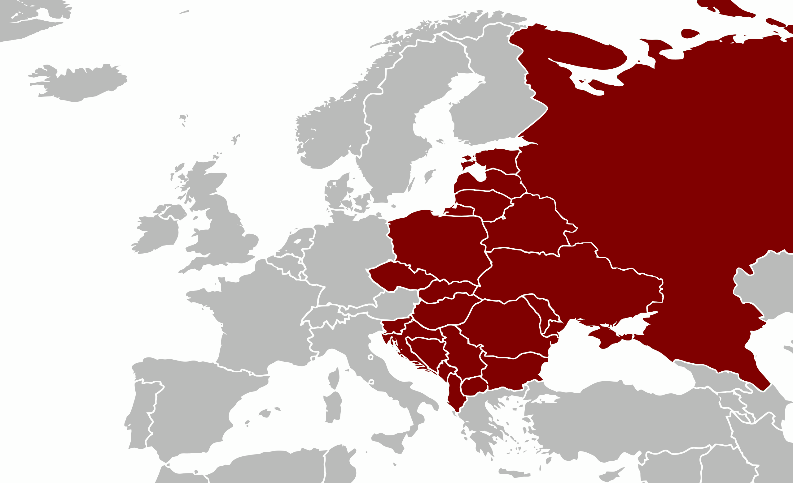

# Russia Ukraine Crisis Weibo (RUW) Dataset


Download link for the dataset is [here](https://uofi.box.com/s/qn99omy53muyi9a4z72s4qktx3h3gzvz).

### Motivation
Online social networks such as Twitter and Weibo play an important role in how people stay informed and exchange reactions. In particular, online social networks during crisis events embody a key opportunity for studying the portability of computational models for various tasks (e.g., information extraction, complex event understanding, misinformation detection, etc.), due to differences in domain, entities, and event types. We, from UIUC, present the **Russia-Ukraine Crisis Weibo (RUW) dataset**, with over 3.5M user posts and comments in our first release.



### Dataset Details
We initiated our data collection process when the crisis escalated with Russia's special military operation on the last week of Feb 2022. The following information are included in the *Russia-Ukraine Crisis Weibo (RUW)* dataset:
|      |  |
| ----------- | ----------- |
| user information     | profile ID, profile name, profile image, profile description, \# of followers     |
| post content  | the main text, as well as any images and videos attached, if available      |
| post metadata  | the \# of likes \& shares on the post, and the publication timestamp of the post    |
| post comments | information similar to the previous three rows, for all comments underneath a user post      |

We are continuing the data collection process to follow the latest development of events in the ongoing crisis, and will update our dataset daily. At present, our dataset statistics is summarized as below:
| (prior to one-hop expansion) |  |
| ----------- | ----------- |
| # Unique Posts w/ Relevant Keywords | 90,000 |
| # Users for these Unique Posts  | 165 |
| # Corresponding Comments in Total | 3.4 M |
| # Users Altogether, w/ Comments Included | 122 K    
| | |
| Avg # Like/Reacts per Posts | 4338 |
| Avg # Shares per Post | 163 |
| | |

Keywords: *俄罗斯 (Russia), 乌克兰 (Ukraine), 普京 (Putin), 泽连斯基 (Zelenskyy), 基辅 (Kiev), 北约 (Nato), 车臣 (Chechen), 俄乌 (Russia-Ukraine), 俄方 (Russian side), 乌方 (Ukraine side), 俄军 (Russia army), 乌军 (Ukraine army), 哈尔科夫 (Kharkiv), 敖德萨 (Odesa), 切尔诺贝 (Chernobyl)*
### Use Cases
There are many interesting task settings that can be experimented with, using our Russo-Ukranian Crises Weibo dataset. These include event clustering, false rumor detection, portability of news analytic methodologies across Twitter and Weibo domains, amongst many more. 

### Related Work
A team at HKUST has released a [Russo-Ukranian Crises Twitter dataset](https://github.com/ehsanulhaq1/russo_ukraine_dataset). It is generally interesting to uncover patterns universal across platforms, regulated by a separate set of rules and participated by a separate set of users with different user behavior. Note that Twitter data (multilingual) involves English as the primary language, while Weibo data involves Chinese as the primary language.

## References
If you find our dataset \& work helpful, please cite:
```
@article{fung2022weibo,
  title={A Weibo Dataset for the 2022 Russo-Ukrainian Crisis},
  author={Fung, Yi R and Ji, Heng},
  journal={arXiv preprint arXiv:2203.05967},
  year={2022}
}
```
